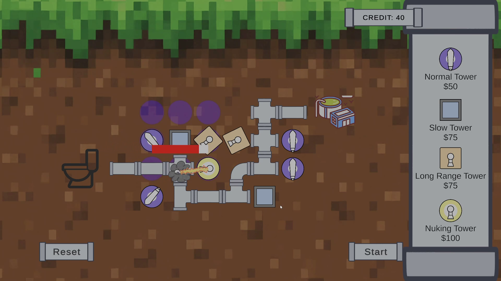

# Plumbers

[[다운 링크]](https://github.com/darkpppet/Plumbers/releases/tag/Relesase) &nbsp; [[Web 플레이 링크]](https://darkpppet.github.io/Plumbers/)

2025 CIEN 게임잼에서 제작한 게임입니다.

주제는 “화장실”로, 화장실 컨셉 타워 디펜스 게임을 제작했습니다.

플레이어는 배치된 타일들을 회전시켜 경로를 만들어야 합니다.

경로에 포함되지 않는 타일은 판매하여 크레딧을 획득할 수 있습니다.

획득한 크레딧으로 타워들을 구매해 배치할 수 있습니다.

웨이브가 시작되면, 몬스터는 경로를 따라 이동합니다.

즉, 긴 경로 - 적은 크레딧 / 짧은 경로 - 많은 크레딧의 trade-off를 선택해야합니다.

---

## 플레이 방법
 - 파이프를 좌클릭하면 파이프가 왼쪽으로 회전합니다
 - 파이프를 우클릭하면 파이프가 오른쪽으로 회전합니다
 - 파이프에 마우스를 올리고 [E] 키를 누르면, 파이프가 판매됩니다.
 - 파이프가 판매된 땅에 마우스를 올리고 [E] 키를 누르면, 파이프를 재구매합니다.
 - 상점에서 원하는 타워를 클릭하여 타워를 구매할 수 있습니다.
 - 구매한 타워를 원하는 빈 땅에 클릭하면 타워가 설치됩니다.
 - 파이프 경로가 존재하지 않으면, [Start]를 클릭해도 시작하지 않습니다. 

---
### history

#### ver 0.2
 - 취약점이 패치된 Unity 버전으로 변경
 - 몬스터가 이동 시 지터링이 발생하는 현상 수정
 - 몬스터의 이동이 더욱 엄밀해지도록 수정
 - 시작/종료 타일에서도 정상적으로 타일 데미지가 들어가도록 수정

#### ver 0.1
 - 출시
